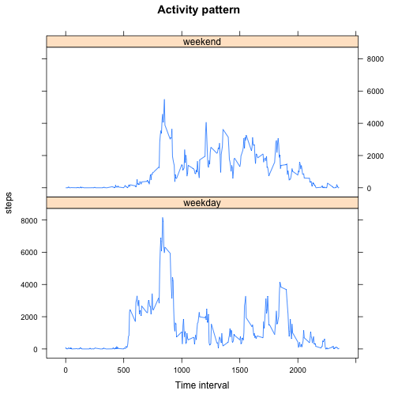

# Reproducible Research: Peer Assessment 1


## Loading and preprocessing the data

```r
library(data.table)

raw_data <- read.csv("activity.csv")
clean_data <- raw_data[!is.na(raw_data$steps), ]

raw_data <- data.table(raw_data)
clean_data <- data.table(clean_data)
```

## What is mean total number of steps taken per day?

```r
daily_data <- clean_data[, sum(steps), by = date]
setnames(daily_data, c("date", "steps"))
mean_total_per_day <- daily_data[, mean(steps), ]
median_total_per_day <- daily_data[, median(steps), ]
```

The mean total number of steps taken per day is 1.0766 &times; 10<sup>4</sup> and the median is 10765.

## What is the average daily activity pattern?

```r
interval_data <- clean_data[, mean(steps), by = interval]
plot(interval_data, type="l")
```

 

```r
max_value = interval_data[, max(V1),]
max_interval = interval_data[V1 == max_value]$interval
```
The interval time with maximum mean value (206.1698) is 835.
## Imputing missing values

### Rows with missing values

```r
na_data <- raw_data[is.na(raw_data$steps), ]
na_num_rows <- nrow(na_data)
```

There are 2304 rows with missing values.

### Inputing missing values strategy 
The missing values will be replaced by the mean of the same interval across all the same *weekday* in the dataset

Add weekday column to data tables:

```r
raw_data$wday <- wday(as.Date(raw_data$date))
na_data$wday <- wday(as.Date(na_data$date))
clean_data$wday <- wday(as.Date(clean_data$date))

head(raw_data, n=10)
```

```
##     steps       date interval wday
##  1:    NA 2012-10-01        0    2
##  2:    NA 2012-10-01        5    2
##  3:    NA 2012-10-01       10    2
##  4:    NA 2012-10-01       15    2
##  5:    NA 2012-10-01       20    2
##  6:    NA 2012-10-01       25    2
##  7:    NA 2012-10-01       30    2
##  8:    NA 2012-10-01       35    2
##  9:    NA 2012-10-01       40    2
## 10:    NA 2012-10-01       45    2
```

Compute the mean steps for all interval per weekday:


```r
data_wdays <- merge(na_data, clean_data, by=c("interval", "wday"), allow.cartesian=TRUE)

interval_weekday_mean <- data_wdays[, mean(steps.y), by = c("interval", "wday")]
setnames(interval_weekday_mean, c("interval", "wday", "steps"))

head(interval_weekday_mean, n=10)
```

```
##     interval wday steps
##  1:        0    1 0.000
##  2:        0    2 1.429
##  3:        0    4 4.250
##  4:        0    5 5.875
##  5:        0    6 0.000
##  6:        0    7 0.000
##  7:        5    1 0.000
##  8:        5    2 0.000
##  9:        5    4 2.250
## 10:        5    5 0.000
```

Impute those means to the intervals with missing steps, joining by weekday and interval:

```r
inputted_data <- merge(na_data, interval_weekday_mean, by=c("wday", "interval"))
inputted_data <- inputted_data[, c("steps.y", "date", "interval", "wday"), with=FALSE]
setnames(inputted_data, c("steps", "date", "interval", "wday"))

head(inputted_data, n=10)
```

```
##     steps       date interval wday
##  1: 0.000 2012-11-04        0    1
##  2: 0.000 2012-11-04        5    1
##  3: 0.000 2012-11-04       10    1
##  4: 0.000 2012-11-04       15    1
##  5: 0.000 2012-11-04       20    1
##  6: 7.429 2012-11-04       25    1
##  7: 0.000 2012-11-04       30    1
##  8: 0.000 2012-11-04       35    1
##  9: 0.000 2012-11-04       40    1
## 10: 0.000 2012-11-04       45    1
```

Append the inputted data on missing values with the known data:


```r
final_data <- rbind(inputted_data, clean_data)
head(final_data)
```

```
##    steps       date interval wday
## 1: 0.000 2012-11-04        0    1
## 2: 0.000 2012-11-04        5    1
## 3: 0.000 2012-11-04       10    1
## 4: 0.000 2012-11-04       15    1
## 5: 0.000 2012-11-04       20    1
## 6: 7.429 2012-11-04       25    1
```

### Histogram of the total number of steps taken each day


```r
daily_inputted <- final_data[, sum(steps), by = date]
setnames(daily_inputted, c("date", "steps"))
hist(daily_inputted$steps, main="Histogram of total steps per day", xlab="Steps")
```

 

Compute median and mean:

```r
new_mean_daily <- daily_inputted[, mean(steps), ]
new_median_daily <- daily_inputted[, median(steps), ]

diff_mean =  new_mean_daily - mean_total_per_day
diff_median =  new_median_daily - median_total_per_day
```

When imputing missing values, the mean total number of steps taken per day is 1.0821 &times; 10<sup>4</sup> and the median is 1.1015 &times; 10<sup>4</sup>. Compared to the estimates from the first part, the new mean is incremented by 55.0209 and the median by 250.

## Are there differences in activity patterns between weekdays and weekends?

Create new factor variable to determine if the data is either a weekday or a weekend day. Wekeend is 1 (sunday) and 6 (saturday):

```r
final_data$wday_type <- c("weekend", "weekday", "weekend")[ findInterval(final_data$wday, c(1, 2, 6, Inf)) ]
```

Aggregate per interval and weekday_type:

```r
agg <- final_data[, sum(steps), by = c("interval", "wday_type")]
setnames(agg, c("interval", "wday_type", "steps"))
head(agg, n=10)
```

```
##     interval wday_type  steps
##  1:        0   weekend  0.000
##  2:        5   weekend  0.000
##  3:       10   weekend  0.000
##  4:       15   weekend  0.000
##  5:       20   weekend  0.000
##  6:       25   weekend 59.429
##  7:       30   weekend  0.000
##  8:       35   weekend  0.000
##  9:       40   weekend  0.000
## 10:       45   weekend  6.857
```

Time series plot panel:

```r
library(lattice) 
xyplot(agg$steps ~ agg$interval|agg$wday_type, main="Activity pattern", type="l", layout=(c(1,2)), ylab="steps", xlab="Time interval")
```

 
